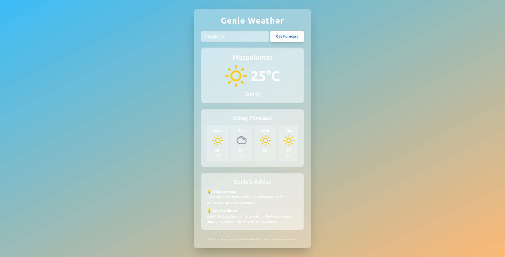

# Genie Weather 🧞‍♂️


## 🚀 [<ins>Live Demo</ins>](https://claytoncrispim.github.io/genie-weather/) 🚀

Genie Weather is an AI-powered weather app that returns a **current + 5-day forecast** plus **simple recommendations** (clothing + activity).  
Important change: the **frontend does NOT call Gemini directly** — it calls a small Express backend that securely proxies the Gemini request.

## 📷 Screenshot


## ✨ Key Features

- **Backend-proxied Gemini calls (safer):** API key lives on the server (`backend/`), not in the browser.
- **AI-generated structured forecast:** App requests **valid JSON** (current weather, daily forecast, recommendations).
- **Automatic Geolocation:** On first load, asks for location to fetch local weather.
- **Dynamic UI & Backgrounds:** Background gradient changes based on weather conditions.
- **Resilient UX:** Loading state, error handling, and cooldown rate-limiting.
- **Clean component structure:** React + Vite + Tailwind, organized into reusable components.


## 🧱 Tech Stack

**Frontend**
- React
- Vite
- Tailwind CSS

**Backend**
- Node.js
- Express
- Google Gemini API

**Browser APIs**
- Geolocation
- Local Storage


## 📁 Project Structure
- genie-weather/

- backend/ # Express API that calls Gemini (keeps GOOGLE_API_KEY private)

- frontend/ # React/Vite UI that calls backend (/api/forecast)

## ✅ How it works (high level)

- The UI builds a prompt like: “current weather + 5-day forecast for X, return valid JSON”.
- The UI sends it to the backend:
  - `POST /api/forecast` with `{ prompt, model }`
- The backend calls Gemini and returns **structured JSON** to the UI.

## 🧪 Run Locally

### 1) Clone
```bash
git clone https://github.com/claytoncrispim/genie-weather.git
cd genie-weather
```

### 2) Backend setup
```bash
cd backend
npm install
```

Create `backend/.env.local` (or `backend/.env`) with:
```bash
GOOGLE_API_KEY=your_google_cloud_api_key_here
PORT=3000
```
Run backend:
```bash
npm run dev
# or: npm start
```

Backend should be available at:

- `http://localhost:3000`

- Health check: `GET http://localhost:3000/health`

### 3) Frontend setup
```bash
cd ../frontend
npm install
```

Create `frontend/.env.local`:
```bash
VITE_RENDER_BACKEND_URL=http://localhost:3000
```
Run frontend:
```bash
npm run dev
```
Open the app and request a forecast.


## 🌍 Production Deploy (Render + GitHub Pages)

### Backend (Render)

- Deploy `backend/` as a Web Service on Render.

- Set env var in Render:

  - `GOOGLE_API_KEY=...`

- Your backend URL will look like:

  - `https://your-service.onrender.com`

### Frontend (GitHub Pages)

This repo uses **GitHub Actions** to build and deploy `frontend/` to Pages.

In GitHub:

- `Settings → Pages → Source` should be **GitHub Actions**

- `Settings → Secrets and variables → Actions → Variables`

  - Add:
    - `VITE_RENDER_BACKEND_URL = https://your-service.onrender.com`

On push to `main`, the Pages workflow builds the frontend with that variable injected.

## 🐞 Debug Mode

Add `?debug=1` to the URL to show a small debug panel:

- Displays the backend URL the app is using
- Lets you click-to-copy it
- Shows build mode (DEV/PROD) and whether `VITE_RENDER_BACKEND_URL` is set
- Warns if you’re on GitHub Pages but the app is accidentally pointing to `localhost`

Example:
```lua
https://claytoncrispim.github.io/genie-weather/?debug=1
```

## 🔐 Environment Variables

This project uses `.env.example` files as documentation for required vars.

- **Backend**

  - `GOOGLE_API_KEY`
  - `PORT` (optional)

- **Frontend**

  - `VITE_RENDER_BACKEND_URL`

Notes:

- `.env.local` is for local development.

- `.env.production` can be used for production builds, but GitHub Pages builds typically use the GitHub Actions variable instead.

## 📌 Notes / Disclaimer

Weather results are AI-generated and may be approximate. Always verify critical weather information via official sources.